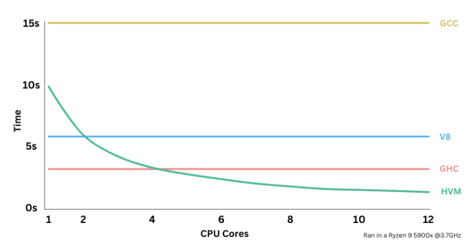

HoC's ROADMAP
=============

Overview
--------

Pre 2022, we've researched a new model of computation. In 2022, we released HVM,
a massively parallel runtime that outperforms state-of-art alternatives given
enough cores. In 2023, we'll raise a $5m seed round that will cover the
following:

1. Incorporate and structure the Higher Order Company

2. Hire a team of developers

3. Develop ThreadBender, Kindelia and Kind

4. Release and market, focusing on adoption

Initial projected budget for the $5m goal:

Title    | Project    | Skills         | Function                | Salary    | Person 
-------- | ---------- | -------------- | ----------------------- | --------- | ------ 
Lead Dev | HoC        | Many           | Lead                    |  $200,000 | Taelin 
Lead Com | HoC        | Many           | Lead                    |  $100,000 | Sipher 
Sr. Dev  | HVM        | Coq / Kind     | Correctness             |  $200,000 | ?
Sr. Dev  | HVM        | Rust           | JIT Compiler            |  $200,000 | ?
Sr. Dev  | HVM        | Rust           | Low-Level Optimizations |  $200,000 | ?
Sr. Dev  | Thd.Bender | Haskell / Kind | JS-HVM Transpiler       |  $150,000 | ?
Jr. Dev  | Thd.Bender | Haskell / Kind | JS-HVM Transpiler       | R$260,000 | Nicolas
Jr. Dev  | Thd.Bender | Haskell / Kind | JS-HVM Transpiler       | R$260,000 | Santi 
Sr. Dev  | Kindelia   | Rust           | Networking & Consensus  |  $150,000 | ?
Jr. Dev  | Kindelia   | Haskell / Kind | Protocol & Execution    | R$260,000 | Derenash
Jr. Dev  | Kindelia   | Rust           | Tooling & QA            | R$260,000 | Rheidner?
Jr. Dev  | Kindelia   | Haskell / Kind | Demo Contracts          | R$130,000 | ?
Sr. Dev  | Kind-Lang  | Type-Theory    | Research                |  $150,000 | ?
Mid Dev  | Kind-Lang  | Haskell / Kind | Kind Design             | R$390,000 | Chiyoku
Jr. Dev  | Kind-Lang  | Haskell / Kind | Kind Package Manager    | R$260,000 | Vicky?
Jr. Dev  | Kind-Lang  | Haskell / Kind | ChatGPT + Wikind        | R$130,000 | Bonatto?
Jr. Dev  | Kind-Lang  | Haskell / Kind | ChatGPT + Wikind        | R$130,000 | Samuel?
Jr. Dev  | Kind-Lang  | Haskell / Kind | ChatGPT + Wikind        | R$130,000 | Sávio?
Sr. Dev  | TheHOC.com | Web Full-Stack | Landing Pages           |  $100,000 | ?
Designer | TheHOC.com | UI / UX        | Landing Pages           |  $100,000 | ?
DevOps   | Infra      |                |                         | R$130,000 | Kingu?
Lawyer   | Legal      |                | Incorporation, Patents  |  $100,000 | ?

Note: 

```
Projected Seed Budget:
+ Leads       = $   600,000
+ HVM         = $ 1,200,000
+ Thd.Bender  = $   500,000
+ Kindelia    = $   550,000
+ Kind-Lang   = $   700,000
+ TheHOC.com  = $   400,000
+ DevOps      = $    50,000     
+ Legal       = $   200,000
+ Unexpected  = $   800,000 * taxes, fees, hires, equipment, cloud, etc.
---------------------------
Total         = $ 5,000,000
```

**Optionally**, we'll cover the following, for an additional $2.8m:

1. Formalization of Interaction Calculus on Kind-Lang: + $200k

3. HVM GPU target (CUDA/Vulkan): + $600k

2. Research HVM on hardware (FPGA/VHDL): + $400k

4. Research HVM on zk-STARKs: + $200k

Projected stretch goal budget:

Title    | Project    | Skills         | Function                | Salary   | Person 
-------- | ---------- | -------------- | ----------------------- | -------- | ------ 
Sr. Dev  | HVM Formal | Coq            | Formalization of HVM    | $100,000 | ?
Sr. Dev  | HVM FPGA   | Verilog / VHDL | HVM hardware research   | $200,000 | ?
Sr. Dev  | HVM GPU    | CUDA / Vulkan  | HVM GPU target          | $150,000 | ?
Sr. Dev  | HVM GPU    | CUDA / Vulkan  | HVM GPU target          | $150,000 | ?
Sr. Dev  | HVM STARKs | zk-proofs      | HVM spec. circuits      | $200,000 | ?

We'll **not** include/ship the following items from the pitch deck:

1. ThreadBender B2B Business. In 2023, we will focus on building the tech and
   promote adoption. Once we have usage on Kindelia, ThreadBender and Kind,
   we'll be in a better position to rework our business plan.

2. HPUs: we can't produce them now, but could in a future, from FPGA research.

3. Cute Cats: we'll keep them for ourselves.

We will run out of funds in Q1 2025, for a 2 year runway.

Up to 2022: Research and Prototype
----------------------------------

After decades of researching a new model of computation, the [Interaction
Net](https://www.semanticscholar.org/paper/Interaction-Combinators-Lafont/6cfe09aa6e5da6ce98077b7a048cb1badd78cc76),
and after a several engineering breakthroughs, we've, in 2022, developed the
prototype for HVM, the first massively parallel runtime in the world. In our
benchmarks, HVM has shown its ability to scale in performance horizontally with
cores. That is, by computing high-level primitives like lambdas,
pattern-matching and recursion in parallel, HVM can greatly speed up existing
programs, by using all the available cores in modern processors. Compared to GCC
(for C-language), V8 (for JavaScript) and GHC (for Haskell), in an unfavorable
benchmark, HVM outperforms all of them in a CPU with 4 or more cores:



2023: Seed Round and Build Applications
---------------------------------------

Now, in 2023, we are executing a Seed Round to found and incorporate the Higher
Order Company. Once this is done, we will hire a team of developers to turn this
exciting technology into 3 user-facing applications that can reach a much wider
audience: ThreadBender, Kind and Kindelia.

### ThreadBender

Since around 2006, processors are getting increasingly more parallel - AMD's next
ThreadRipper CPU has 96 cores - yet, software isn't catching up with that trend.
Most programming languages in use today are still single-threaded by default.
While some of them offer features capable of parallelizing software, doing so is
extremely hard and expensive, due to the overwhelming complexity of concurrent
synchronization and hard-to-debug non-deterministic behaviors.

Thanks to HVM's powerful parallelization primitives - beta-reduction,
pattern-matching, equational rewrites - ThreadBender is capable of transpiling
high-level languages such as Python, JavaScript and Go to HVM, allowing
developers to run existing code in dozens of cores. As processors become more
parallel, the pressure to parallelize software will increase. The programming
industry is due to a revolution on how we write code. By being as simple as
Python and as parallel as CUDA, ThreadBender has everything it takes to lead
this revolution.

### Kind

Mathematicians won't check proofs manually forever. There is a growing body of
academics attempting to [digitalize
mathematics](https://www.youtube.com/watch?v=Dp-mQ3HxgDE) right now. In a
future, all major theorems and proofs will be available in a huge ecosystem
of proofs that you can import, modify and check automatically, just like package
managers of programming like JavaScript's npm or Rust's cargo work today.

For that to happen, though, we need something: a proof checker. All stablished
proof checkers (Coq, Lean, Agda...) are extremely slow and have a sub-par UI/UX.
Thanks to HVM, we can proudly claim Kind is, by far, the [**fastest** proof
checker](https://github.com/kindelia/functional-benchmarks) in the world today.
It is not the **best** though: it is still missing important features, including
a package manager, a totality checker, tactics, among others. We will make
Kind-Lang the best proof-checker. Once we do, will be in a privileged position
to dominate this market, that will be huge in the future.

### Kindelia

The blockchain space is in dire need for a peer-to-peer computer that just
works. Layer 1 networks such as Ethereum, Cardano and Solana bought many
innovations to the field, but, from the end-user perspective, are still
underwhelming in several aspects: scalability, security, UX, as well as
economical and political centralization - all of which are important for
widespread adoption. It is hard to name a layer 1 that could be part of Linux's
kernel one day. Kindelia will be that.

Thanks to HVM, Kindelia's computate and space throughput can be 500x higher than
Ethereum, making it capable of hosting massive, real-time online worlds; and,
no, that's not relying on layer 2, increased centralization, or complex crypto
that greatly impacts UX. Moreover, its contracts have their security backed by
mathematical proofs, making it the most trustworthy home for these assets.
These, combined with other design choices that abide to HoC's standard of
quality, make Kindelia the most efficient and secure layer 1 in the world. We
believe it has everything it takes to become the Bitcoin of peer-to-peer
computers, and the host of the massive metaverses of the future.

### Synergy

Our projects have synergy and form a connected ecosystem.

- **HVM** is the heart of everything: all projects run on it.

- **Kindelia** can be used to host unstoppable **Kind** applications.

- **Kind** makes **Kindelia** more secure, via formal verification.

- **ThreadBender** improves **Kindelia** by allowing JavaScript contracts.

2024: Adoption and Business
---------------------------

On its current state, HVM is an advanced tool that can only be used by
experienced functional developers: it wasn't built with adoption in mind.
Despite that, it already reached 5.6k stars on GitHub - more than widely popular
projects, like Cardano. Once we build applications that apply to a much wider
audience: ThreadBender, for developers; Kind, for mathematicians; Kindelia, for
crypto enthusiasts - then, we'll be able to reach a much wider audience and be
widely recognized as a competent company capable of shipping groundbreaking
technology. Once we've stablished a respected name in the market, we will be in
a much stronger position to research ways to profit from our products.
